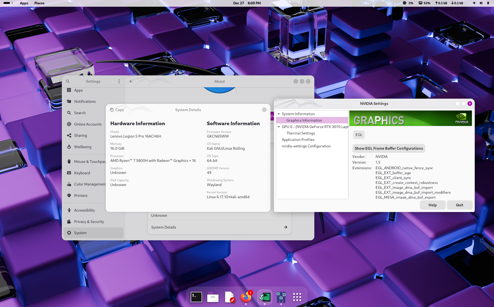

# **GNOME 49 \+ Wayland \+ NVIDIA on Kali Linux (Laptop)**

This document is based on a real problem I faced while installing Kali Linux with GNOME 49 on a laptop with an NVIDIA GPU. I’m writing this so others don’t waste days reinstalling, breaking their system, or ending up stuck in TTY like I did.

This is not an official guide. It’s just what actually happened, what broke, and what finally worked.

---

## **System Setup (important)**

This applies if you have something like:

* Kali Linux **2025.4 (this is the latest kernel)**  
* **GNOME 49**   
* **NVIDIA laptop GPU** (RTX / GTX)  
* Often AMD \+ NVIDIA laptops, set to **Discrete GPU** in BIOS

If your setup is very different, this may not apply.

---

## **The Problem I Kept Hitting**

After a fresh Kali install:

* GNOME login screen shows up  
* Login works  
* Desktop is blank / frozen / half rendered  
* Sometimes GNOME just exits  
* I end up back in **TTY**

The problem began a week ago when my GUI suddenly fell apart and I was unable to log in to my Kali Linux after a  system update and upgrade. Then, I decided to have a fresh start by installing Kali Purple which I had eyes on because of its distinctive defensive applications. After countless fresh Kali Linux Purple installations, I kept on hitting the same mistake over and over again. First I install Kali on dual boot where I select GNOME as the display manager, then install the system. At first, the login session also worked and I could navigate through the GUI effortlessly. Then, everytime I tried to install a NVIDIA graphics card, I always ended up on Black screen (TTY only), or sometimes even the display freezing completely. I tried everything available on the internet, but everything kept falling apart.

Logs showed things like:

**Connecting to wayland lost**  
**Shutting down GNOME Shell**

No clear error. No crash message. Just broken.

---

## **Why This Happens**

### **GNOME 49**

So, I researched the newest version of GNOME and found out that GNOME 49 is Wayland-only now. There is no Xorg fallback anymore. So, previously when I tried to install the NVIDIA driver with XORG configuration, it kept falling apart. I even thought of using the XFCE4 desktop environment, but I was so keen on having the GNOME interface I tried relentlessly. So, I found out that it expects the GPU driver to fully support modern Wayland features like:

* Atomic modesetting  
* Proper DRM support  
* Stable synchronization

---

### **nouveau (open-source NVIDIA driver)**

Another reason for the constant failure was nouveau which is an open-source NVIDIA driver. On modern NVIDIA GPUs, nouveau loads and works, but only partially.

What actually worked in my case was:

* GPU detected  
* Display shows something

What did not fully work:

* Advanced modesetting which GNOME needs to function.

So GNOME:

1. Starts normally  
2. Tries to render the desktop  
3. Loses the Wayland connection  
4. Exits cleanly

The kernel doesn’t crash, so logs look "fine", which was also a bit confusing.

---

## **Why Installing NVIDIA Drivers Often Makes It Worse**

Every time I installed nvidia-driver, I ended up with:

* No GUI  
* Only TTY  
* System feels broken

The reason is simple:

* nouveau gets disabled  
* NVIDIA driver loads  
* BUT DRM modesetting is not enabled by default  
* GNOME Wayland cannot start  
* No Xorg fallback so it gets stuck in TTY

This single missing setting caused most of the pain.

---

## **The Fix That Actually Worked**

This is the only sequence that worked for me reliably.

### **Step 0: Safety (very important)**

Before doing anything:

sudo systemctl set-default multi-user.target

This ensures you can boot into TTY instead of a black screen if something goes wrong.

---

### **Step 1: Install NVIDIA driver**

*\# sudo apt update*  
*\# sudo apt install \-y nvidia-driver firmware-misc-nonfree*

During this installation, the system tells you to reboot because of the nouveau driver causing conflict, however rebooting right after this step is not recommended.

---

### **Step 2: Enable DRM modeset**

*\# echo "options nvidia-drm modeset=1" | sudo tee /etc/modprobe.d/nvidia-drm.conf*

Also add it to kernel arguments:

*\# sudo sed \-i 's/GRUB\_CMDLINE\_LINUX\_DEFAULT="/GRUB\_CMDLINE\_LINUX\_DEFAULT="nvidia-drm.modeset=1 /' /etc/default/grub*   
*\# sudo update-grub*

---

### **Step 3: Make sure GNOME uses Wayland**

Edit:

*\# sudo nano /etc/gdm3/custom.conf*

Put:

\[daemon\]

WaylandEnable=true

DefaultSession=gnome-wayland.desktop

***Save and Exit***

---

### **Step 4: Disable nouveau** 

### *\# echo \-e "blacklist nouveau\\noptions nouveau modeset=0" | sudo tee /etc/modprobe.d/blacklist-nouveau.conf*

---

### **Step 5: Rebuild initramfs**

*\# sudo update-initramfs \-u*

---

### **Step 6: Reboot**

*\# sudo reboot*

---

## **After Reboot**

You should land in TTY.

Check:

*\#  lsmod | grep nvidia*  
*\# cat /sys/module/nvidia\_drm/parameters/modeset*  
*\# nvidia-smi*

We want:

* NVIDIA modules loaded  
* Modeset \=Y  
* GPU visible in nvidia-smi

---

### **Start GNOME**

*\# sudo systemctl set-default graphical.target*  
*\# sudo systemctl start gdm*

GNOME should finally load normally.

---

## **How to Confirm Which GPU Is Used**

*\# echo $XDG\_SESSION\_TYPE*

It should say:

- wayland

*\# nvidia-smi*

- You should see gnome-shell using the GPU.

## **My Working Version of NVIDIA in GNOME 49**

## **What I Learned**

* nouveau is not "broken", it’s just not enough for GNOME 49  
* GNOME Wayland is very strict now  
* NVIDIA drivers need DRM modeset for Wayland  
* Most guides online are outdated (they assume Xorg still exists)  
* Laptop NVIDIA GPUs behave differently than desktops

---

## **Final Notes**

This problem is not user error.  
It’s just bad timing between:

* GNOME dropping X11  
* Kali moving fast  
* NVIDIA open drivers not catching up yet

I’m putting this on GitHub so others don’t repeat the same mistakes.

If this helped you, feel free to reuse it.

**References**

*GNOME software to better support NVIDIA’s proprietary Linux driver*. (n.d.). Phoronix. [https://www.phoronix.com/news/GNOME-Software-Better-NVIDIA](https://www.phoronix.com/news/GNOME-Software-Better-NVIDIA)  
Artuk, C. (2025). *Kali Linux 2025.4: GNOME 49 goes Wayland-Only, X11 finally retired*. Medium. Retrieved December 24, 2025, from [https://canartuc.medium.com/kali-linux-2025-4-gnome-49-goes-wayland-only-x11-finally-retired-90befe9c7830](https://canartuc.medium.com/kali-linux-2025-4-gnome-49-goes-wayland-only-x11-finally-retired-90befe9c7830)  
*Wayland on Gnome with Nvidia Card*. (2024, April 21). EndeavourOS. [https://forum.endeavouros.com/t/wayland-on-gnome-with-nvidia-card/54226](https://forum.endeavouros.com/t/wayland-on-gnome-with-nvidia-card/54226)  
*Atomic mode setting design overview, part 2*. (n.d.). LWN.net. [https://lwn.net/Articles/653466/](https://lwn.net/Articles/653466/)

